# Reisplanner app
Een stand-alone app voor Wear Os om treinreizen te plannen binnen Nederland met alle treinvervoerders.
De app in beschikbaar in het Nederlands en Engels (wordt op basis van systeemtaal geselecteerd).

##### Table of Contents
- [Features](#Features)  
  - [Thuisscherm](#Thuisscherm)
  - [Stations kiezen](#Stationpicker)
  - [Reisadviezen](#Reisadvies-detail)
  - [Trein Detail](#Treinrit-detail)

## Features
Bijna alle functies vereisen een internetverbinding om gegevens op te halen. Voor één functie is een GPS-signaal nodig.

### Thuisscherm
Om later in het proces een reisadvies op te kunnen stellen, is er informatie nodig over de treinstations waartussen gereisd wordt. Zie het onderstaande screenshot op het thuisscherm:

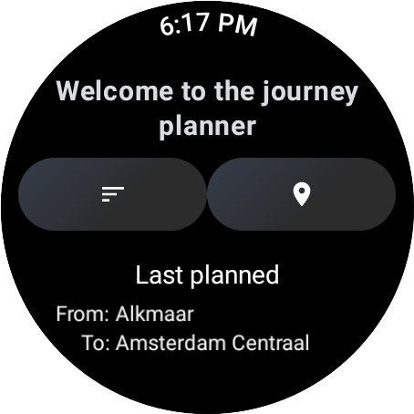

### Stationpicker

Op het thuisscherm zijn te zien:

- De twee mogelijkheden om de stations te kiezen: A-Z lijst (links) en GPS (rechts) optie.
- Laatst gepland reis (niet te zien wanneer er nog geen reis is gepland).

Om het station waar de reis zal starten (vertrekstation) in te voeren, heeft de gebruiker de keuze uit twee opties. Het station opzoeken in de A-Z lijst of door middel van zijn huidige locatie (hiervoor is wel toestemming nodig van de gebruiker).
In onderstaande afbeelding is de A-Z lijst weergegeven. Bovenaan de lijst is een zoekbalk waarin de gebruiker een zoekopdracht voor een stationsnaam kan invoeren. De lijst zal dan worden ingekort met stations die de zoekopdracht (deels) in de naam hebben.

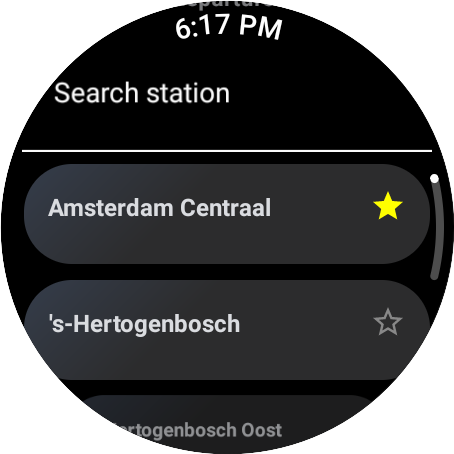

De gebruiker heeft tevens de mogelijkheid om stations als 'favoriet' te markeren door op het sterretje te klikken. Deze zal dan geel worden. Alle stations die als 'favoriet' zijn gemarkeerd, verschijnen altijd bovenaan in de A-Z lijst. Als de gebruiker het station niet langer als 'favoriet' wil hebben, klikt de gebruiker op het gele sterretje om het te verwijderen. Alle favoriete stations worden lokaal op het horloge opgeslagen.

Een tweede mogelijkheid om het vertrekstation te kiezen is door de stations in de buurt op te halen. Hiervoor is wel een actief GPS-signaal en toestemming nodig. In onderstaande afbeelding is een foto van de tweede mogelijkheid (GPS):

Indien er geen toestemming is gegeven, wordt de gebruiker naar de A-Z lijst geredirect. Als er wel toestemming is gegeven, worden de stations in de buurt opgehaald inclusief de afstand tussen het horloge en het station, zie afbeelding hieronder:

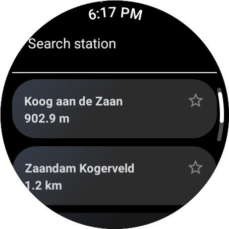

Als een station in de A-Z lijst of de lijst met stations in de buurt wordt geselecteerd, wordt de gebruiker doorgestuurd naar de A-Z lijst om het aankomststation te kiezen. Zodra de gebruiker het aankomststation heeft uitgekozen, worden de reisadviezen opgehaald en worden deze stations op het horloge opgeslagen als de laatst geplande route.
### Reisadviezen
Na het selecteren van de stations worden de route en de reisadviezen weergegeven:

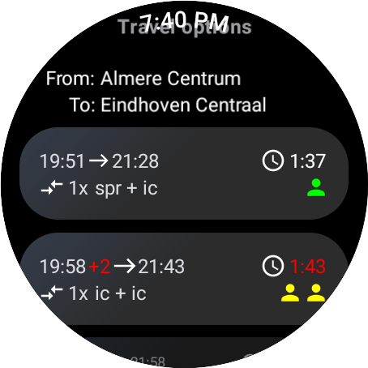
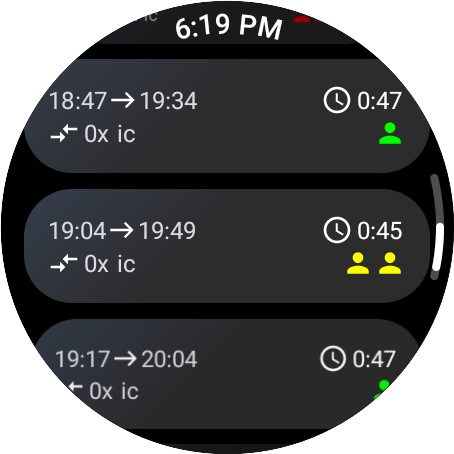
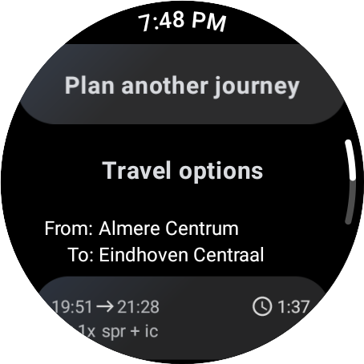
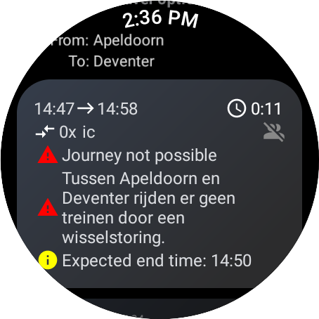
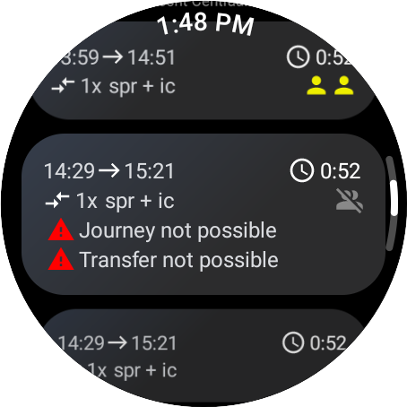

Een reisadvies bestaat uit:

- Vertrektijd (en eventuele vertraging)
- Aankomsttijd (en eventuele vertraging)
- Totale reistijd in het formaat H:MM
- Het aantal overstappen
- Het type treinen waarmee gereisd wordt
- De drukte-indicatie
- Of een reisadvies geannuleerd is en eventueel een reden, zie hieronder:
- Eventuele verstoringen en werkzaamhedenmeldingen

De gebruiker kan van boven naar beneden vegen om de reisadviezen te verversen. Bovenaan het scherm (en in eerste instantie buiten zicht, behalve als er naar boven wordt gescrold) is een knop om terug te keren naar het thuisscherm om een andere reis te plannen.

Bij het klikken op het stukje boven het eerste reisadvies, waar de vertrek- en aankomststations staan, worden de reisadviezen voor de andere richting opgehaald. In dit geval wordt er een reis gepland van Almere Centrum naar Eindhoven Centraal. Als er op die tekst wordt gedrukt, haalt de app de reisadviezen op van Eindhoven Centraal naar Almere Centrum.

Bij het klikken op een reisadvies wordt de detailweergave geopend voor dat specifieke reisadvies.
### Reisadvies detail

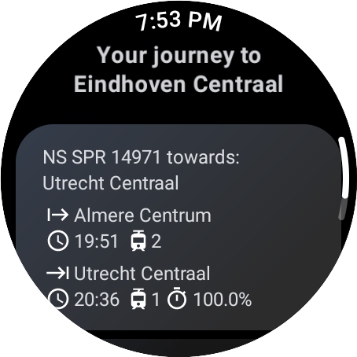
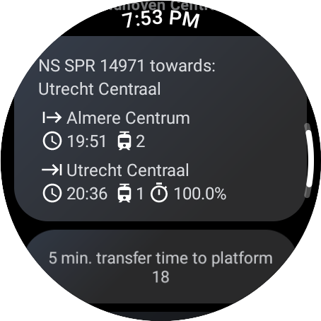
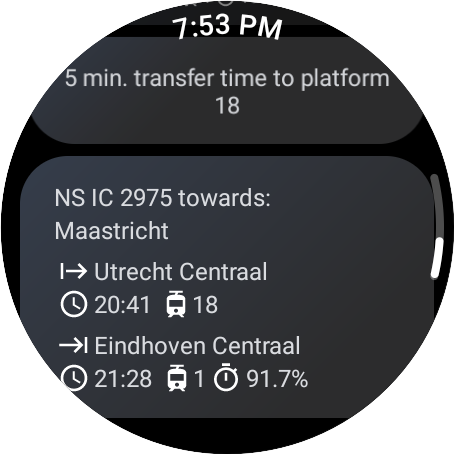

De detailweergave van een reisadvies bestaat uit (van boven naar beneden):

- Eindbestemming van de reis zelf
- Operator
- Treintype
- Ritnummer
- Eindbestemming van de trein
- Station waar wordt opgestapt
- Vertrektijd (en eventuele vertraging)
- Vertrekspoor
- Station waar wordt uitgestapt
- Aankomsttijd (en eventuele vertraging)
- Aankomstspoor
- Punctualiteit (indien beschikbaar)

Als een reisadvies uit meerdere ritten bestaat (overstappen), worden de overstappen ook weergegeven, bestaande uit:

- Overstaptijd
- Vertrekspoor van de volgende trein

In dit scherm kan de gebruiker de gegevens verversen door vanaf de bovenkant van het scherm naar beneden te vegen. Ook kan de gebruiker teruggaan naar het vorige scherm (het scherm met alle reisadviezen) met de terugknop op het horloge zelf. Het scherm opent op de plaats waar de gebruiker was gebleven. Dus als de gebruiker het onderste reisadvies heeft geselecteerd, opent het reisadviezenscherm ook daar.

Bij het selecteren van een treinrit in de reisadviesdetailweergave wordt de informatie getoond over de treinrit zelf.

### Treinrit detail

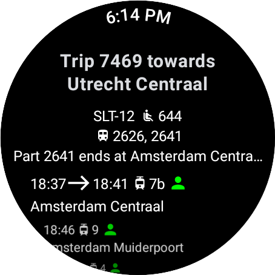
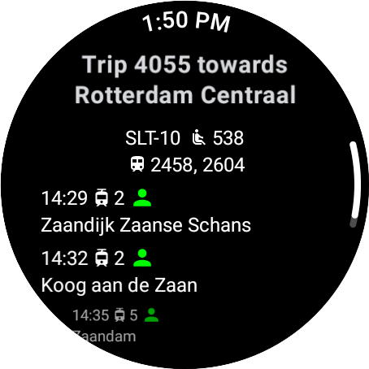

De detailweergave van een treinrit bestaat uit (van boven naar beneden):

- Ritnummer
- Eindbestemming van de trein
- Materieeltype en aantal wagons
- Aantal zitplaatsen
- Treinstel(len)
- Indien de trein gesplitst wordt: het treinstel dat achterblijft en het station waar gesplitst wordt
- Stops
  - Aankomsttijd (en indien de aankomsttijd verschilt van de vertrektijd, wordt de vertrektijd apart weergegeven)
  - Aankomstspoor
  - Compacte weergave van de drukte (de kleur geeft aan hoe druk het is)
  - De naam van het station